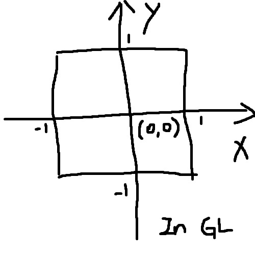

# Coordinates

## Introduction

There are different coordinate systems used in a OpenGL program. 

## XY(Z) Coordinates

Different coordinate systems are used on different graphic libraries. 

In Java, the origin locates at the top left corner of the area. The positive direction for X axis is from left to right, and for Y axis it is from top to bottom. The values are in the range of (0 ~ ), in which the units are pixels.  

 

In OpenGL, the coordinate system is very different. The origin locates at the center of the rendering area. The positive direction for X axis if from left to right, and for Y axis it is from bottom to top. The range is (-1.0 ~ 1.0), which can be understood as the ratio of the total width or height of the rendering area. For 3-D graphics, we can simply add one more demension -- Z. It's nothing different compared to X and Y. But since it's 3-D, we will need other properties such as a viewpoint to define how we look at the object. For the ease of explanation, we'll only focus on 2-D in this document. 

## UV Coordinates

For textures in OpenGL, we will use another coordinate system -- UV coordinates to tell which part of the texture is being used for rendering. It's similar to the XY coordinates but with the range is (0 ~ 1.0). Also, the origin locates at the bottom right of the texture.

 

## RGBA Model

RGBA stands for red, green, blue and alpha. RGBA color space is a model for defining color. There are different scales for RGB or RGBA. Sometimes you will see a scale like (0 ~ 255). In OpenGL, the range of the scale we use is (0 ~ 1.0).